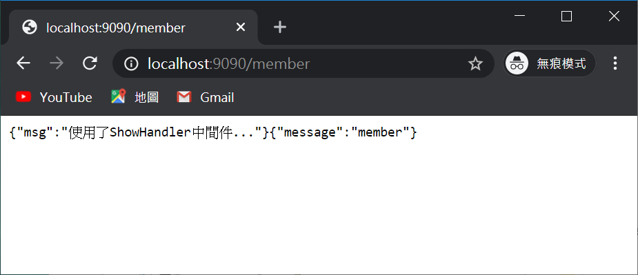

# Golang Gin
動手練習，並製作筆記

# 靜態文件處理

存放目錄
```
./static
```


# / 

**GET**

回傳

```
{"message":"Hi"}
```
    


# /login

**GET**


**POST**


# /json

**GET**

回傳

```
{"age":20,"message":"Hello Golang","name":"IvesShe"}
```


# /more_json

**GET**

回傳

```
{"name":"ChiChi","message":"Hello World","age":18}
```


# /web

**GET**

回傳

```
{"age":"","message":"Hi","name":"18"}
```


# /blog/:name/:age

**GET**

輸入 ex

```
http://localhost:9090/blog/iveshe/20
```

回傳

```
{"age":"20","name":"iveshe"}
```


# /user

**GET**

輸入 ex

```
http://localhost:9090/user?username=IvesShe&password=123456
```

回傳

```
{"status":"ok"}{"username":"IvesShe","password":"123456"}
```


# /form

**POST**

回傳

```
{
    "status": "/form POST ok"
}{
    "username": "ivesshe",
    "password": "111111"
}
```


# /json

**POST**

回傳

```
{
    "status": "/json POST ok"
}{
    "username": "ivesshe",
    "password": "111111"
}
```


# /upload

**GET**


**POST**


# /upload_more

- /upload **GET**


- upload_more **POST**

```
{"message":"3 files uploaded!"}
```


上傳成功


# /turn_this

轉向turn_that

# /turn

輸出
```
{"message":"turn_that"}
```


# /shop

## GET

輸出
```
{"method":"GET"}
```


## POST

輸出
```
{
    "method": "POST"
}
```


## PUT

輸出
```
{
    "method": "PUT"
}
```


## DELETE

輸出
```
{
    "method": "DELETE"
}
```


# /book

同/shop

# /video

## shop 

輸出
```
{"method":"/video/shop"}
```


## login 

輸出
```
{"method":"/video/login"}
```


## user 

輸出
```
{"method":"/video/user"}
```


# /member

輸出
```
{"msg":"使用了ShowHandler中間件..."}{"message":"member"}
```


